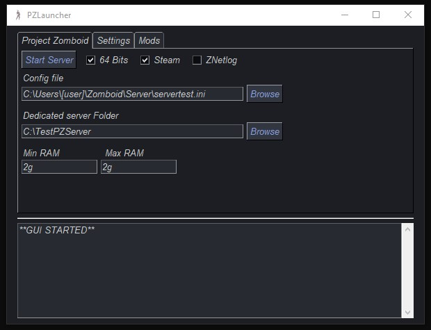
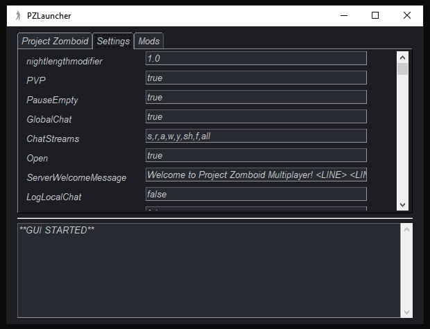
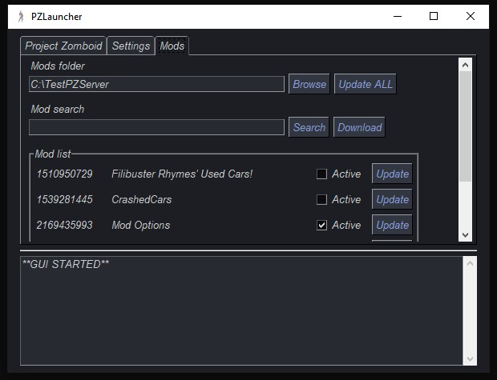

#  PZLauncher


PZLauncher is an GUI front-end for Project Zomboid Dedicated Server.

## Features

- Install the necessary files to start the server
- Launch the server inside the GUI itself
- Modify and change server .ini config file
- Change path of PZ Dedicated server folder
- Find and sync active mods with .ini config file
- Update/Download mods from the GUI

## Usage

When starting the program, it looks for the server files in the steam folders, if it doesn't find them, it will ask to install it.

Once it finds the files it will show the main window, in the Project Zomboid tab you can set parameters for the server and change path for the files, then in the settings tab you can change any settings inside the .ini, for last in the mods tab you can activate mods, change the folder where they are and update them.

When you start the server for the first time it will ask to set an admin password, to set this you need to execute the server outside the GUI in a cmd shell, you can use the .bat file in the server folder.

At last if you start the server and then wish to modify anything it will not reflect any change until the server is stopped, this also apply when you update/download the mods.

## Installation

Check the [Releases](https://github.com/Errots/PZLauncher/releases) page to download the latest launcher version.

*OR*

Clone the project

```bash
git clone https://github.com/Errots/PZLauncher
```

Then with python installed activate the environment and run

```bash
.\Scripts\activate
pip install PySimpleGUI
pip install PyInstaller
py main.py
```

### Warning

The release exe uses python 3.9 so to run windows 7 it requires api-ms-win-core-path-l1-1-0.dll, to bypass this use the win7 release

## Screenshots





## Theres something wrong?

Please open an issue here if you identify any error.

## License

MIT
